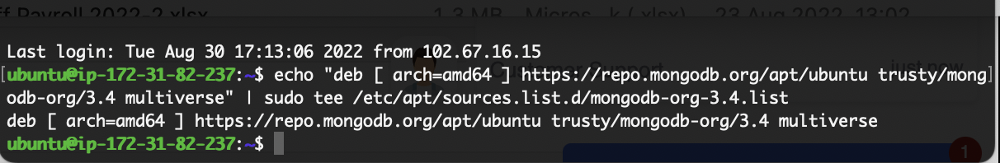

# Project4

**PROJECT 4**

**Documentation and Steps to follow**

The first step is updating Ubuntu as captured in the picture below

This is followed by upgrading Ubuntu as captured in the picture below

This is then followed by adding certificates to our server as captured below

I then proceeded to install Nodejs as captured below

I created the database to store our document after which we will echo it.

I then installed MongoDB and started the server

I then started the server as mentioned above and cheecked the status of the server

I then installed NPM. 

I then installed a Body Parser package as captured below

I then went ahead to create the book folder and started the NPM

I also installed Mongoose as captured below

I then went ahead to creat all the required folders for my project and saved the necessary codes in them

I then added a security group to my AWS server to allow access from everywhere as captured below

Finally, i opened the browser using the public IP with the Port 3300 which i had given access to and then came up with the final page as seen below.

*Special Thanks to Moses Itoya for the assistance on the live session.*

**THANK YOU**
